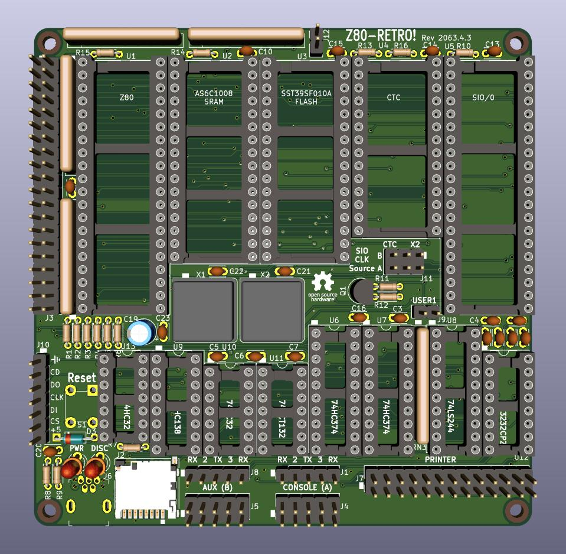

# Retro Z80 CPU Board

This project was designed to run CP/M 2.2 from an SD card.  It should be an attainable goal for anyone that can solder through-hole parts to assemble it. Note that J10 is an optional header that allows a Sparkfun SD card breakout board [DEV-13743](https://www.digikey.com/en/products/detail/sparkfun-electronics/DEV-13743/5881845) to used instead of soldering on the surface-mount SD socket part.

**Note that a [companion board](https://github.com/johnwinans/2065-Z80-programmer) is designed that can be used to program the FLASH chip in the event that you don't have a programmer already.**
The companion bare PCB should cost about $2 more if it is ordered at the same time as this board from JLCPCB or other similar proto-board shops.

* A youtube playlist discussing this project and how to build your own can be found in [John's Basement](https://www.youtube.com/watch?v=oekucjDcNbA&list=PL3by7evD3F51Cf9QnsAEdgSQ4cz7HQZX5)
* A PDF version of the schematic can be found [here](2063-Z80.pdf).
* Here is the as-built [BOM](2063-Z80.md) with links to the datasheets for all the parts.
* Here is another [BOM](2063-Z80-sockets.md) with links to sockets for the chips.
* To configure a new PI for use with this programmer board as well as to develop Z80 code 
for the Z80 Retro board, see this [PI Setup Guide](https://github.com/johnwinans/raspberry-pi-install)
* More software for this project will be added as it evolves.

# Links to Datasheets Seen in the YouTube Videos

* [Z80 User Manual UM0080](http://www.zilog.com/docs/z80/um0080.pdf)
* [Z80 CPU Peripherals User Manual UM0081](http://www.zilog.com/docs/z80/um0081.pdf)
* [Z80 Family Product Specifications Handbook - 1984](http://www.bitsavers.org/components/zilog/z80/Z80_Family_Product_Specifications_Handbook_Feb84.pdf)
* [Wikipedia UART Article](https://en.wikipedia.org/wiki/Universal_asynchronous_receiver-transmitter)
* [AY-3-1015D UART Datasheet](https://rocelec.widen.net/view/pdf/bvesdj0cqf/GSIIS01845-1.pdf)

