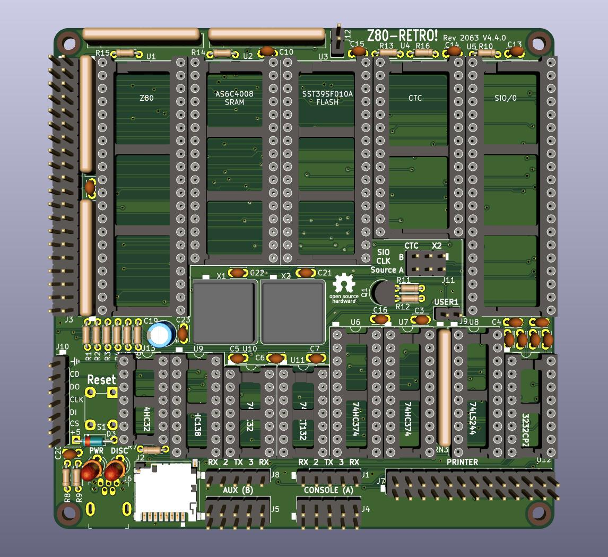

# Retro Z80 CPU Board

This project was designed to run CP/M 2.2 from an SD card.  It should be an attainable goal for anyone that can solder through-hole parts to assemble it. Note that J10 is an optional header that allows a Sparkfun SD card breakout board [DEV-13743](https://www.digikey.com/en/products/detail/sparkfun-electronics/DEV-13743/5881845) to used instead of soldering on the surface-mount SD socket part.

Here is an easy-to-find direct link to the [PDF of the schematic](https://github.com/Z80-Retro/2063-Z80/raw/main/2063-Z80.pdf) for a quick view.

## Where to get Boards & Software

* You can order boards from any prototype PCB vendor.  For example, I show how you can order these boards from [JLCPCB](https://jlcpcb.com/) or [OSHPark](https://oshpark.com/) by uploading the gerber files found in the releases of this and the flash programmer projects as shown in this [Z80 Retro! - How To Order PC Boards](https://youtu.be/AUg_sbPnzn0) video on YouTube.
  - Gerber files for the CPU board: [2063-Z80-v3](https://github.com/johnwinans/2063-Z80/releases/download/v3/2063-Z80-gerbers.zip)
  - Gerber files for the FLASH programmer: [2065-Z80-programmer-v2](https://github.com/johnwinans/2065-Z80-programmer/releases/download/v2.0/2065-Z80-programmer-gerbers.zip) (This is used with a Raspberry PI to program the FLASH chip on the CPU board.)

* Software for this project can be found in my [2063-Z80-cpm](https://github.com/johnwinans/2063-Z80-cpm) repo.

* Note that the [FLASH programmer](https://github.com/johnwinans/2065-Z80-programmer) has been designed to work with a Raspberry PI in the event that you don't already own such programmer.  This companion programmer PCB should cost about $2 more when it is ordered at the same time as the CPU board from JLCPCB or other similar proto-board shops as shown in the [Z80 Retro! - How To Order PC Boards](https://youtu.be/AUg_sbPnzn0) video on YouTube.

## Links to Related Material

* A youtube playlist discussing this project and how to build your own can be found in [John's Basement](https://www.youtube.com/watch?v=oekucjDcNbA&list=PL3by7evD3F51Cf9QnsAEdgSQ4cz7HQZX5)
* A PDF version of the schematic can be found [here](2063-Z80.pdf).
* Here is the as-built [BOM](2063-Z80.md) with links to the datasheets for all the parts.
* Here is another [BOM](2063-Z80-sockets.md) with links to sockets for the chips.
* To configure a new PI for use with this programmer board as well as to develop Z80 code 
for the Z80 Retro board, see this [PI Setup Guide](https://github.com/johnwinans/raspberry-pi-install)
* More software for this project will be added as it evolves.

## Links to Related Datasheets Seen On YouTube

* [Z80 Datasheet PS0178](https://www.zilog.com/docs/z80/ps0178.pdf) with detailed timing diagrams.
* [Z80 User Manual UM0080](http://www.zilog.com/docs/z80/um0080.pdf) with detailed descriptions of each instruction.
* [Z80 Assembly Language Programming Manual](http://zxevo.ru/inc/Zilog_Z80_assembly_language_programming_classic.pdf) - The original version of the instructions without the OCR errors present in UM0080.
* [Z80 CPU Peripherals User Manual UM0081](http://www.zilog.com/docs/z80/um0081.pdf) discusses the CTC and SIO.
* [Z80 Family Product Specifications Handbook - 1984](http://www.bitsavers.org/components/zilog/z80/Z80_Family_Product_Specifications_Handbook_Feb84.pdf) has nicer pictures of the SIO registers.
* [Wikipedia UART Article](https://en.wikipedia.org/wiki/Universal_asynchronous_receiver-transmitter)
* [AY-3-1015D UART Datasheet](https://rocelec.widen.net/view/pdf/bvesdj0cqf/GSIIS01845-1.pdf) (Has a discussion of the 16X bit-rate clock with diagrams etc. applicable to all UARTs.)

## Serial Port Cable Parts

* [How to make IDC cables](https://youtu.be/gZ420Z-8HuU) for the serial ports.
* [IDC 2x5 connectors](https://www.amazon.com/gp/product/B07S1NFG4S)
* [IDC D-SUB 9-pin connectors (Digikey)](https://www.digikey.com/en/products/detail/assmann-wsw-components/A-DSF-09LPIII-Z/924263)
* [IDC D-SUB 9-pin connectors (Amazon)](https://www.amazon.com/Uxcell-a15030600ux0494-Female-Connector-Ribbon/dp/B00YM41NTW)

## Parallel Port Cable Parts

* [IDC 2x13 connectors](https://www.amazon.com/gp/product/B07RXK96GV)
* [IDC D-SUB 25-pin connectors (Digikey)](https://www.digikey.com/en/products/detail/amphenol-icc-commercial-products/L17DBFRA25S/1972210)
* [IDC D-SUB 25-pin connectors (Amazon)](https://www.amazon.com/Fielect-Female-Adapter-Connector-Ribbon/dp/B082GMDNTS)

## Ribbon Cable

* [40-conductor (Amazon)](https://www.amazon.com/Eowpower-40Pin-40Way-Rainbow-Ribbon/dp/B079KQ6K3Y) - peel off a
 26-pin strip and a 10-pin strip to make one parallel and one serial cable (cut the 10-pin strip in half length-wise to make two serial cables.

